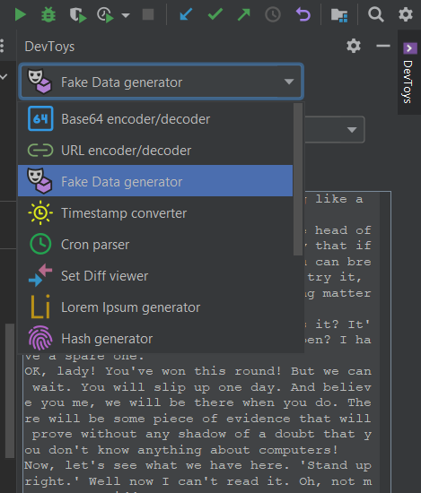

<h1 align="center">
     
    I Love DevToys
</h1>

An Intellij IDEA (Community and Ultimate) free plugin which is highly inspired from the [DevToys](https://devtoys.app) software available on Windows.  
Find useful tools in a Tool Window in the top right corner of your IDE:
* Base64 encoder/decoder</li>
* URL encoder/decoder
* Fake Data generator (addresses, Chuck Norris facts, Job titles, Pokemon names, Rick and Morty characters, The It Crowd quotes...)
* Timestamp converter
* Cron parser (Unix, Quartz, Spring 5.3+, Cron4j)
* Set Diff viewer (compare two texts, ignoring lines ordering)
* Lorem Ipsum generator
* Hash generator (MD5, SHA1,256,384,512)
* UUID generator
* JSON &lt;&gt; YAML converter
* BENCODE &lt;&gt; JSON converter
* ASCII &lt;&gt; HEX converter
* CSV/HTML/Java/JS/XML (un)escaper
* Etc...

The global idea is to provide these tools on Linux and macOS (Windows is also supported), because the original DevToys software is available on Windows only. 

**Work in progress**: I am trying to reproduce most of the DevToys features, but it will take some time. Also, contributions are welcome 😎.    
If you want to support my work, you can consider buying an [Extra Icons](https://plugins.jetbrains.com/plugin/11058-extra-icons) plugin license or make a [donation](https://buymeacoff.ee/jlermitage). Thank you! If you already did this, hum... fiesta! 🥳 (And again, thank you so much!) 

## Download

Download plugin from the JetBrains marketplace or via your IDE: <kbd>File</kbd>, <kbd>Settings...</kbd>, <kbd>Plugins</kbd>, <kbd>Marketplace</kbd> then select `I Love DevToys`.

## Build

See [Makefile](./Makefile) file.

## ToDo

* improve the GUI
  * settings: remember last opened tool
* add more tools, like Base64 from file, GZip encoder/decoder, JWT encoder/decoder, HTML escaper, cron parser, text tools, graphics tools...

Nota: I think we don't need to reproduce tools that exist in IntelliJ already, like the regex tester, diff viewer, conflict resolver, and markdown previewer.

## License

MIT License. In other words, you can do what you want: this project is entirely OpenSource, Free and Gratis.

This project integrates original or modified components and files from:

* Etienne Baudoux, [MIT License](https://github.com/veler/DevToys/blob/main/LICENSE.md) -> created tool icons from original `DevToys` tools SVG icons, and yeah, the global idea of this plugin!
* The Apache Software Foundation, [Apache License](https://commons.apache.org) -> using the `Apache Commons Codec` and `Apache Commons Lang` libraries for handling Hash and CSV/HTML/Java/JS/XML Escaping functionalities
* Miguel De Anda, [MIT License](https://github.com/mdeanda/lorem/blob/master/license.txt) -> using the `Lorem` library for generating Lorem Ipsum strings 
* FasterXML, LLC, [Apache License](https://github.com/FasterXML/jackson-core/blob/2.14/LICENSE) -> using the `Jackson core`, `databind` and `dataformat-yaml` libraries for handling JSON/YAML conversion
* SnakeYaml, [Apache License](https://bitbucket.org/snakeyaml/snakeyaml/src/master/LICENSE.txt) -> using the `SnakeYaml` library for handling JSON/YAML conversion
* Adam Peck, [Apache License](https://github.com/dampcake/bencode/blob/master/LICENSE) -> using the `bencode` library for handling BENCODE/JSON conversion
* DataFaker.net, [Apache License](https://github.com/datafaker-net/datafaker/blob/main/LICENSE) -> using the `Data Faker` library for generating fake data
* cron-parser.com, [Apache License](https://github.com/jmrozanec/cron-utils/blob/master/LICENSE) -> using the `Cron-utils` library for parsing cron expressions
* codearte.io, [Apache License](https://github.com/Codearte/props2yaml/blob/master/LICENSE) -> using the `props2yaml` library for handling Properties to YAML conversion

## Screenshot

